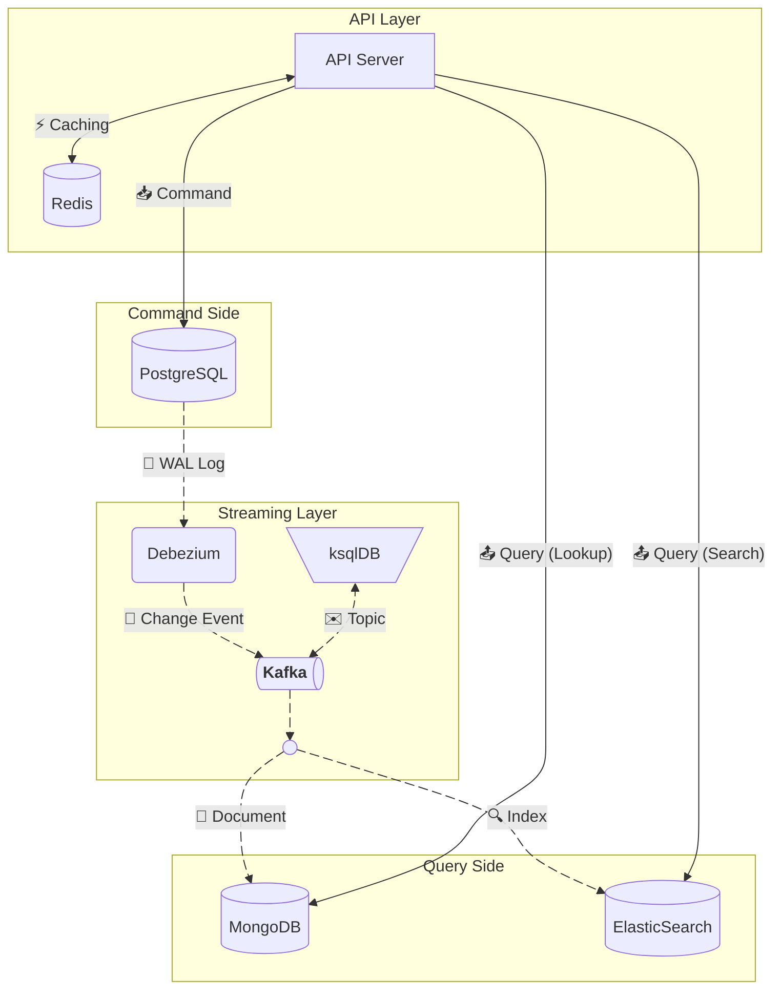
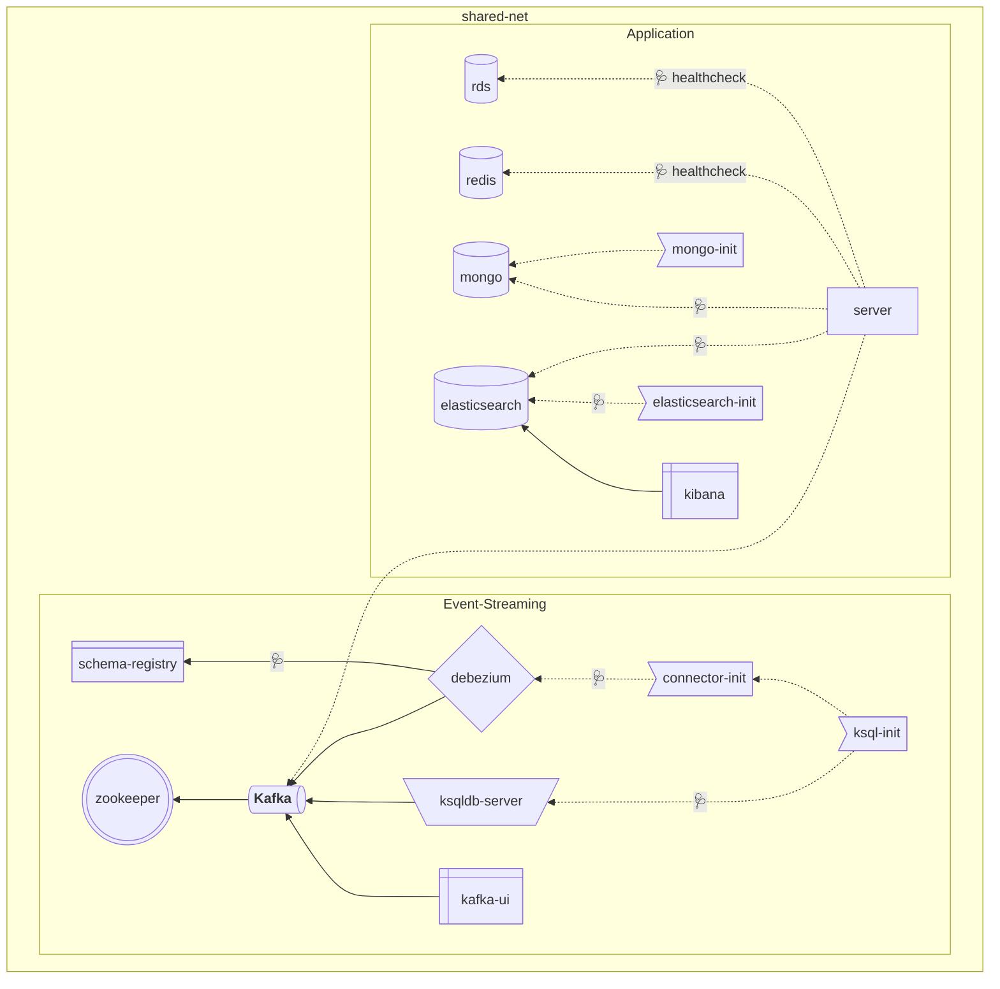
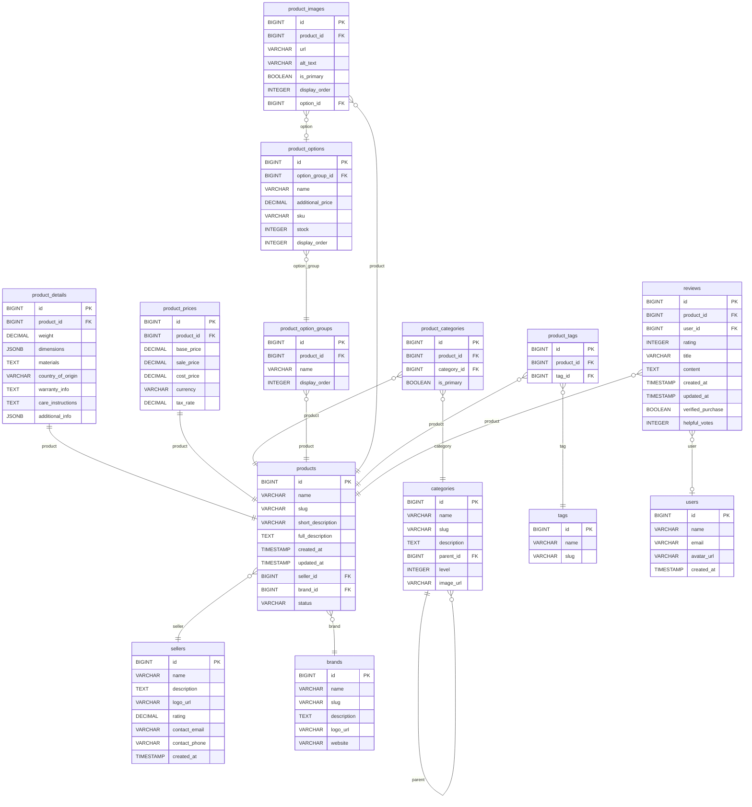

# CQRS 시스템 설계/구축 챌린지

> 원티드 프리온보딩 챌린지 백엔드 31차

[](https://github.com/narcisource/Pre-Onboarding-Challenge-BE-31/releases) [](https://github.com/narcisource/Pre-Onboarding-Challenge-BE-31/actions/workflows/deploy-openapi.yml) [](https://github.com/narcisource/Pre-Onboarding-Challenge-BE-31/actions/workflows/deploy-test-report.yml)

## 기술 스택

[](https://www.confluent.io/ko-kr/product/ksqldb/) [](https://kafka.apache.org/) [](https://www.apicur.io/registry/) [![Apache Zookeeper](https://img.shields.io/badge/Apache_Zookeeper-4E7A37.svg?logo=data:image/svg+xml;base64,PHN2ZyB4bWxucz0iaHR0cDovL3d3dy53My5vcmcvMjAwMC9zdmciIHZlcnNpb249IjEuMCIgdmlld0JveD0iMCAwIDQ2OSA1MTAiPgogIDxwYXRoIGZpbGw9IiNGRkYiIGQ9Ik0yNzkgMTczYTI3MTYgMjcxNiAwIDAgMS0xNzIgMTcwbC0yLTItMi00Yy0yLTEtMy0zLTItM3YtMWMtMSAxLTYtNC02LTZsLTItMS0xLTN2LTFjLTEgMS0xMy0xOC0xMi0xOWwtMS0xLTMtNC0zLTRjLTEgMC00IDMtNCA1bC03IDhhMTkzIDE5MyAwIDAgMC0yNSAzMGwtMiAzYzEgMSAwIDEtMSAybC0yIDFjMSAyLTEgNS0yIDRoLTFjMSAxIDAgMy0xIDVhMjgwIDI4MCAwIDAgMC03IDlsLTEgMi0yIDVhMTc4IDE3OCAwIDAgMC0xMyAyNmMtMiAyLTIgMS0zIDE1djEwbDEgM3YxbDEgMXYybDEgMnYyYzEtMSAzIDQgMyA3bDEgMSAzIDQgNyAxMSAzIDcgMSAxYTE3MiAxNzIgMCAwIDAgMzkgMzhjMC0yIDQgMiA0IDRoM2wxIDEgMiAxYzAgMiAwIDIgMSAxaDNsMiAyIDEgMSAyLTEgMiAxIDEtMSAxLTFjMyAwIDQtMSA3LTMgMi0yIDMtNCAzLThsMi04YzEtMiAyLTUgMC0zdi0xbDEtNCAxLTIgMi00IDEtMyAxLTEgMS0yIDItMyAxLTIgNC04di0xbDItMiAxLTFjLTEtMiA0LTkgNS05di0ybDEtMiAxLTEgMS0yIDItMmMtMS0xIDAtMSAxLTJsMi0ydi0ybDEtMSAyLTIgMS0yIDMtNSA0LTYgMi0yIDEtMSAzLTQgMi0zIDItMiAyLTQgMi0zYzItMiAyLTMtMS0zLTIgMC0yNi0yNC0yNi0yNWE0NTM4IDQ1MzggMCAwIDEgMTI3LTEyOGw3OS04MEw0MzkgNDZsMjktMjktOS04LTktOC0xNzEgMTcyek0wIDQxMGwxIDN2LTZsLTEgM3oiLz4KPC9zdmc+Cg==&style=flat&logoColor=black)](https://zookeeper.apache.org/) [![Debezium](https://img.shields.io/badge/Debezium-6DCA92.svg?logo=data:image/svg+xml;base64,PD94bWwgdmVyc2lvbj0iMS4wIiBlbmNvZGluZz0idXRmLTgiPz4KPHN2ZyB2ZXJzaW9uPSIxLjEiIGlkPSJMYXllcl8xIiB4bWxucz0iaHR0cDovL3d3dy53My5vcmcvMjAwMC9zdmciCgl4bWxuczp4bGluaz0iaHR0cDovL3d3dy53My5vcmcvMTk5OS94bGluayIgeD0iMHB4IiB5PSIwcHgiCgl2aWV3Qm94PSIwIDAgNjQgNjQiIHdpZHRoPSI2NCIgaGVpZ2h0PSI2NCIgc3R5bGU9ImVuYWJsZS1iYWNrZ3JvdW5kOm5ldyAwIDAgNjQgNjQ7IgoJeG1sOnNwYWNlPSJwcmVzZXJ2ZSI+CjxnPgoJPHBhdGggZD0iTTQ1LjgsNTUuOWMwLDQuNSwzLjYsOC4xLDguMSw4LjFoMTBWNTRjMC00LjUtMy42LTguMS04LjEtOC4xSDU0Yy03LjEsMC0xMi45LTUuOC0xMi45LTEyLjlWMzEKCQljMC00LjUtMy42LTguMS04LjEtOC4xSDMxYy03LjEsMC0xMi45LTUuOC0xMi45LTEyLjlsMCwwVjguMUMxOC4yLDMuNiwxNC41LDAsMTAsMEgwdjEwYzAsNC41LDMuNiw4LjEsOC4xLDguMUgxMAoJCWM3LjEsMCwxMi45LDUuOCwxMi45LDEyLjl2MS45YzAsNC41LDMuNiw4LjEsOC4xLDguMUgzM2M3LjEsMCwxMi45LDUuOCwxMi45LDEyLjlsMCwwVjU1Ljl6IiBmaWxsPSIjRkZGIi8+Cgk8cGF0aCBkPSJNNjQsMzFjMC00LjUtMy42LTguMS04LjEtOC4xSDU0Yy03LjEsMC0xMi45LTUuOC0xMi45LTEyLjlWOC4xQzQxLDMuNiwzNy40LDAsMzIuOSwwaC0xMHYxMC4xCgkJYzAuMSw0LjQsMy43LDgsOC4xLDhIMzNjNy4xLDAsMTIuOSw1LjgsMTIuOSwxMi45bDAsMHYxLjljMCw0LjUsMy42LDguMSw4LjEsOC4xSDY0VjMxeiIgZmlsbD0iI0ZGRiIvPgoJPHBhdGggZD0iTTY0LDguMWMwLTQuMy0zLjUtNy45LTcuOC04LjFINDUuN3YxMC4xYzAuMSw0LjQsMy43LDgsOC4xLDhINjRWOC4xeiIgZmlsbD0iI0ZGRiIvPgoJPHBhdGggZD0iTTAsMzNjMCw0LjUsMy42LDguMSw4LjEsOC4xSDEwYzcuMSwwLDEyLjksNS44LDEyLjksMTIuOXYxLjljMCw0LjUsMy42LDguMSw4LjEsOC4xaDEwVjUzLjkKCQljLTAuMS00LjQtMy43LTgtOC4xLThIMzFjLTcuMSwwLTEyLjktNS44LTEyLjktMTIuOWwwLDB2LTEuOWMwLTQuNS0zLjYtOC4xLTguMS04LjFIMFYzM3oiIGZpbGw9IiNGRkYiLz4KCTxwYXRoIGQ9Ik0wLDU1LjljMCw0LjMsMy41LDcuOSw3LjgsOC4xaDEwLjVWNTMuOWMtMC4xLTQuNC0zLjctOC04LjEtOEgwVjU1Ljl6IiBmaWxsPSIjRkZGIi8+CjwvZz4KPC9zdmc+&style=flat&logoColor=black)](https://debezium.io/)  
[](https://nestjs.com/) [](https://nodejs.org/ko) [](https://www.typescriptlang.org/)  
[](https://redis.io) [](https://www.elastic.co/kr/elasticsearch) [](https://www.mongodb.com/) [](https://www.postgresql.org/) [](https://typeorm.io/)  
[](https://about.codecov.io/) [](https://jestjs.io/) [![Testcontainers](https://img.shields.io/badge/Testcontainers-17a6b2.svg?logo=data:image/svg+xml;base64,PHN2ZyB4bWxucz0iaHR0cDovL3d3dy53My5vcmcvMjAwMC9zdmciIHZpZXdCb3g9IjAgMCAyMDAgMjAwIiB3aWR0aD0iMjAwIiBoZWlnaHQ9IjIwMCI+DQogIDxwYXRoIGZpbGw9IiMzNjFlNWIiIGQ9Ik0xODcuMjcsNTIuOTFjMC0uMTEsLjAxLS4yMiwuMDEtLjMzLDAtLjMxLS4wMy0uNjEtLjA4LS45MS0uMjYtMS40OC0xLjE3LTIuNzktMi41LTMuNTYtLjE1LS4wOS0uMy0uMTYtLjQ2LS4yM0wxMDIuNTgsLjY4Yy0xLjU4LS45MS0zLjUyLS45MS01LjEsMEwxNS4yOCw0OC4xYy0xLjU4LC45MS0yLjU1LDIuNTktMi41NSw0LjQxbC0uMDQsOTQuOWMwLDEuODIsLjk3LDMuNTEsMi41NSw0LjQybDgyLjE2LDQ3LjQ5Yy43OCwuNDUsMS42NiwuNjgsMi41NSwuNjhoLjExYy45LDAsMS43OC0uMjQsMi41NS0uNjhsODIuMTYtNDcuNDljMS41OC0uOTEsMi41NS0yLjYsMi41NS00LjQybC0uMDQtOTQuNVoiLz4NCiAgPHBvbHlnb24gcG9pbnRzPSIxMDAgMTYgMjcuMjUgNTggMjcuMjUgMTQyIDEwMCAxODQgMTcyLjc1IDE0MiAxNzIuNzUgNTggMTAwIDE2IiBmaWxsPSIjMTZkNmM3Ii8+DQogIDxwb2x5Z29uIHBvaW50cz0iMTcyLjc1IDU4IDE3Mi43NSAxNDIgMTAwIDE4NCAxMDAgMTAwLjAxIDE3Mi43NSA1OCIgZmlsbD0iIzAyN2Y5ZSIvPg0KICA8cG9seWdvbiBmaWxsPSIjMTdhNmIyIiBwb2ludHM9IjE3Mi43NSA1OCAxMDAgMTAwLjAxIDI3LjI1IDU4IDEwMCAxNiAxNzIuNzUgNTgiLz4NCjwvc3ZnPg==&style=flat&logoColor=black)](https://testcontainers.com/) [](https://swagger.io/)  
[](https://github.com/features/actions) [](https://eslint.org/) [](https://prettier.io/)  
[![Docker Compose](https://img.shields.io/badge/Docker_Compose-2AB4FF.svg?logo=data:image/svg+xml;base64,PHN2ZyB4bWxucz0iaHR0cDovL3d3dy53My5vcmcvMjAwMC9zdmciIHZpZXdCb3g9IjAgMCA1MjMgNjY1Ij4KICA8cGF0aCBmaWxsPSIjZmNmY2ZjIiBmaWxsLXJ1bGU9ImV2ZW5vZGQiIGQ9Ik00MTggMWMtNiAxLTkgMy0xMyA4LTQgMy00IDMtMTAgMS0xMi02LTYwIDAtNjYgOC01IDYtMTEgNDQtOCA1MGwyMyAxN2M3IDQgNyA2IDIgNy0yMyAzLTM3IDI5LTI5IDUyIDMgOSAzIDktMTAgNi0xOS01LTI0LTYtNDUtNS00NyAwLTg2IDE4LTEwOSA1MGExMzUgMTM1IDAgMCAwLTI0IDY0Yy0zIDI4IDIgNDggMTcgNzJsMjIgMjdjNDAgNDQgNDEgNjYgMyA5MS00NSAzMC0xMDQgMTktMTA2LTIwLTEtMTYgNC0yOSAxNy01MiAxMy0yNCAxNC0zMyAzLTUybDEzLThjMjQtMTIgMjItOSAyMy0zNCAwLTIyIDItMjAtMjMtMzAtMTgtNi0yMC02LTQwLTEtMjggOS00MCAxNC00MSAxOCAwIDItMSAzLTIgMy03IDAtMTQgMTItMTUgMjUtMSAyMSA2IDI5IDMwIDM2IDMwIDkgMzUgMjQgMTkgNDktMzYgNTMtMzIgMTAyIDExIDEyMSAzNSAxNiA3NCAxMyAxMTktOWwxMS01IDMgMzJjMCAzNC00MCAzOC04OSA4bC0xNi0xMGMtNTEtMjktMTAyIDI0LTY2IDcwIDE1IDIwIDQyIDIxIDQ2IDIgMi04IDAtMTEtMTAtMTktMTYtMTItMTctMjQtMi0yNyA1LTEgMjYgOCAyOCAxMmwzNCAyOSAyMCAxMiAyMCA4YzM2IDEzIDgyLTE1IDgyLTUwIDAtMTAgMC0xMCA2LTUgMTAgMTAgMTggMTYgMjMgMTkgNiAzIDYgNCAxIDctNSAyLTUgMi01IDctMSA4IDEgMjkgNCAzMyA0IDcgNjMgNDYgNjkgNDYgMyAwIDQ4LTI1IDUxLTI5IDItMSAzLTM0IDEtMzZsLTE2LTljLTE2LTgtMTYtOC05LTEwIDE5LTcgMzctMjcgNDMtNDdsNS0xYTE2NSAxNjUgMCAwIDAgNjAtMTNjOSAwIDM0LTIyIDQwLTM0bDQtOGM0LTcgNi0yNiA2LTU2IDAtMjkgMS0yNy0xMC0yOS02LTItOC0zLTEzLTgtMzAtMjktNzktMjMtOTYgMTAtMyA3LTMgNy04IDlzLTYgNS01IDE3djE1YzEgMTQgNCAxNiAzNCAyOGwxMiA2YzcgMyA3IDMgMzAtNyA4LTMgOS0zIDkgMS02IDIyLTY0IDQyLTczIDI0YTg3IDg3IDAgMCAwLTYzLTQyYy04IDAtOCAwIDYtMTFhNzM2IDczNiAwIDAgMCA4NS04OWwzLTVjMTktMzEgMjEtNzMgMy0xMDctNy0xNS0yMy0zNS0zNi00OC0zOS0zNi00Ni00Ny0zOC02MiA0LTggMTUtMTcgMjAtMTVhNDUyIDQ1MiAwIDAgMCA1NS0xMmMxMS00IDEzLTUgMTQtMTAgMC00IDItNyA5LTE0IDI0LTI2LTgtODAtNDMtNzFNMjI4IDMzNGMxIDEgMCAxLTEgMS0yMCAwLTI4IDMyLTEyIDQyIDE3IDkgMzctMyAzNy0yMiAwLTctNy0xNy0xMS0xN3YtMWMzLTIgMC0zLTctNGwtNiAxbTU0IDgtNCAxYy0yMiAzLTI1IDM5LTMgNDQgMjQgNSA0MS0yMSAyNS0zOGwtNS0zdi0zYy0xLTItMTQtMy0xMy0xbS00OSAxMjBjLTYgNy05IDE0LTkgMjQgMCA4IDEgMTIgMyA2IDItMTIgOC0yOCAxMy0zM3YtM2MtMSAwLTQgMi03IDZtOTcgNGMwIDIgMjMgMTcgMjcgMTcgMiAwIDEtMy00LTctOS03LTIzLTEzLTIzLTEwbS01NCA2Yy0yMSA1MSAyOSA5NiA3MyA2NyA4LTYgOC03LTEtOC0zOS0zLTYzLTIzLTY2LTU0LTItMTItMy0xMy02LTUiLz4KPC9zdmc+Cg==&style=flat&logoColor=black)](https://docs.docker.com/compose/) [](https://www.docker.com/)

## 개발문서

### API 명세서

본 프로젝트의 API 명세서는 GitHub Pages을 통해 Swagger UI로 제공됩니다.

| [](https://narcisource.github.io/Pre-Onboarding-Challenge-BE-31/) |
| --- |
| &nbsp;&nbsp;&nbsp;[API 명세서 바로가기](https://narcisource.github.io/Pre-Onboarding-Challenge-BE-31/)&nbsp;&nbsp;&nbsp; |

- GitHub Pages에 게시된 Swagger 문서는 **정적 문서용**으로 제공되며,  
  백엔드 서버 및 데이터베이스가 연결되어 있지 않기 때문에 실제 요청은 처리되지 않습니다.

- API 요청을 정상적으로 테스트하려면,  
  로컬 환경에서 Docker Compose를 사용해 서버와 데이터베이스를 실행한 후 Swagger UI에 접속합니다.

| Category | Method | URI | Summary |
| --- | --- | --- | --- |
| [상품 관리](https://github.com/NarciSource/Pre-Onboarding-Challenge-BE-31/blob/main/apps/api-server/src/product/presentation/controllers/Product.controller.ts) | POST | /products | 상품 등록 |
|  | GET | /products | 상품 목록 조회 |
|  | GET | /products/{id} | 상품 상세 조회 |
|  | PUT | /products/{id} | 상품 수정 |
|  | DELETE | /products/{id} | 상품 삭제 |
| [상품 옵션 관리](https://github.com/NarciSource/Pre-Onboarding-Challenge-BE-31/blob/main/apps/api-server/src/product/presentation/controllers/Product_Options.controller.ts) | POST | /products/{id}/options | 상품 옵션 추가 |
|  | PUT | /products/{id}/options/{optionId} | 상품 옵션 수정 |
|  | DELETE | /products/{id}/options/{optionId} | 상품 옵션 삭제 |
|  | POST | /products/{id}/images | 상품 이미지 추가 |
| [카테고리](https://github.com/NarciSource/Pre-Onboarding-Challenge-BE-31/blob/main/apps/api-server/src/category/presentation/controllers/Category.controller.ts) | GET | /categories | 카테고리 목록 조회 |
|  | GET | /categories/{id}/products/ | 특정 카테고리의 상품 목록 조회 |
| [메인 페이지](https://github.com/NarciSource/Pre-Onboarding-Challenge-BE-31/blob/main/apps/api-server/src/browsing/presentation/controllers/Main.controller.ts) | GET | /main | 메인 페이지 상품 및 카테고리 목록 조회 |
| [리뷰](https://github.com/NarciSource/Pre-Onboarding-Challenge-BE-31/blob/main/apps/api-server/src/review/presentation/controllers/Review.controller.ts) | GET | /products/{id}/reviews | 상품 리뷰 조회 |
|  | POST | /products/{id}/reviews | 상품 리뷰 작성 |
|  | PUT | /reviews/{id} | 리뷰 수정 |
|  | DELETE | /reviews/{id} | 리뷰 삭제 |

## 다이어그램

### System Architecture Diagram



#### Debezium – Kafka – ksqlDB 기반 실시간 CQRS 아키텍처

1. API Layer

   - **API Server**: 클라이언트로부터 Command(쓰기 요청)와 Query(읽기 요청)를 처리하는 진입점.  
      Command 요청은 Command Side를 통해 처리하고, Query 요청은 Query Side를 통해 처리.

   - **Redis**: API 레이어에서 읽기 요청의 응답 속도를 높이기 위해 캐시로 사용.  
      API 서버와 양방향으로 연결되어 캐시 조회 및 갱신 수행.

2. Command Side

   - **PostgreSQL**: 시스템의 쓰기 전용 데이터 저장소.  
      Command Side의 영속 데이터가 저장되며, 변경 사항은 CDC로 감지됨.

3. CDC (Change Data Capture)

   - **Debezium** (PostgreSQL Connector): PostgreSQL의 _WAL_(Write-Ahead Log)을 읽어 변경 이벤트를 추출.  
      추출된 이벤트를 Kafka 토픽으로 발행.

4. Messaging

   - **Kafka**: 모든 변경 이벤트와 스트리밍 데이터를 전달하는 중앙 메시징 플랫폼.  
      Debezium에서 발행한 CDC 이벤트를 토픽에 저장하고, 이를 소비자(ksqlDB, Sink Connector 등)가 구독하도록 함.

5. Streaming Processing

   - **ksqlDB**: Kafka 토픽의 실시간 스트림을 읽어 변환, 필터링, 집계 등 스트리밍 처리 수행.  
      처리된 결과를 새로운 Kafka 토픽에 발행하여 후속 시스템에서 사용 가능하게 함.

6. Query Side

   - **MongoDB**: CQRS에서의 읽기 전용 Document DB 역할.  
      *Kafka Connect MongoDB Sink Connector*가 Kafka의 처리된 데이터를 저장.  
      API Layer의 ID 조회나 집계 기반 읽기 요청 처리.

   - **Elasticsearch**: CQRS에서의 읽기 전용 Search Index 역할.  
      *Kafka Connect Elasticsearch Sink Connector*가 Kafka의 처리된 데이터를 색인화.  
      API Layer의 검색 및 전문(Full-text) 조회 요청 처리.

7. 데이터 흐름 요약

   - _Command_: `API Server → PostgreSQL → Debezium → Kafka → ksqlDB → Kafka → Sink Connectors → MongoDB / Elasticsearch`

   - _Query_: `API Server → Redis (캐시) / MongoDB / Elasticsearch`

&nbsp;

<details>
<summary>Module Dependency Diagram</summary>



</details>

&nbsp;

### Entity Relationship Diagram


<details>



</details>

### 테스트 리포트

테스트 통과 여부와 커버리지 현황은 시각적으로 제공됩니다.

| [](https://narcisource.github.io/Pre-Onboarding-Challenge-BE-31/test-report) | [](https://codecov.io/gh/narcisource/Pre-Onboarding-Challenge-BE-31) |
| --- | --- |
| [테스트 리포트 바로가기](https://narcisource.github.io/Pre-Onboarding-Challenge-BE-31/test-report) | [커버리지 대시보드 바로가기](https://codecov.io/gh/narcisource/Pre-Onboarding-Challenge-BE-31) |

커버리지는 Codecov를 통해 분석됩니다.  
[](https://codecov.io/gh/NarciSource/Pre-Onboarding-Challenge-BE-31)


## 폴더 구조

<details>
<summary>열기</summary>

```
Pre-Onboarding-Challenge-BE-31
├─ .env
├─ README.md
├─ docker-compose.yml
│  ├─ docker-compose.streaming.yml
│  ├─ docker-compose.tools.yml
│  ├─ Dockerfile.server
│  └─ Dockerfile.cdc
├─ jest.config.ts
│  ├─ jest.base-config.ts
│  ├─ jest.global-setup.ts
│  └─ jest.teardown.ts
├─ package.json
│  ├─ package-lock.json
│  ├─ .prettierrc
│  ├─ eslint.config.mjs
│  └─ nest-cli.json
├─ tsconfig.json
├─ config
│  ├─ logging
│  │  └─ log4j.properties
│  ├─ connectors
│  │  ├─ register.sh
│  │  ├─ source
│  │  │  ├─ postgres-product-connector.json
│  │  │  ├─ postgres-product_option-connector.json
│  │  │  ├─ postgres-product_related-connector.json
│  │  │  ├─ postgres-merchant-connector.json
│  │  │  ├─ postgres-category-connector.json
│  │  │  ├─ postgres-review-connector.json
│  │  │  └─ postgres-tag-connector.json
│  │  └─ sink
│  │     ├─ mongo-product_summary-connector.json
│  │     ├─ mongo-product_catalog-connector.json
│  │     ├─ mongo-featured_category-connector.json
│  │     ├─ mongo-nested_category-connector.json
│  │     ├─ es-product_summary-connector.json
│  │     ├─ es-product_catalog-connector.json
│  │     ├─ es-featured_category-connector.json
│  │     └─ es-nested_category-connector.json
│  ├─ mongo
│  │  └─ init-replica.js
│  └─ elasticsearch
│     ├─ register.sh
│     └─ templates
│        ├─ product_summary-template.json
│        ├─ product_catalog-template.json
│        ├─ featured_category-template.json
│        └─ nested_category-template.json
├─ db
│  ├─ rdb
│  │  ├─ 01.ddl.sql
│  │  ├─ 02.sellers.sql
│  │  ├─ 03.brands.sql
│  │  ├─ 04.categories.sql
│  │  ├─ 05.tags.sql
│  │  ├─ 06.products.sql
│  │  ├─ 07.product_options.sql
│  │  ├─ 08.product_extended.sql
│  │  ├─ 09.users.sql
│  │  └─ 10.reviews.sql
│  └─ ksqldb
│     ├─ 01.raw.sql
│     ├─ 02.state_product_category.sql
│     ├─ 03.state_category_product.sql
│     ├─ 04.state_image.sql
│     ├─ 05.state_rating.sql
│     ├─ 06.state_option.sql
│     ├─ 07.view_product_summary.sql
│     ├─ 08.view_product_catalog.sql
│     ├─ 09.view_featured_category.sql
│     └─ 10.view_nested_category.sql
├─ libs
│  ├─ config
│  │  └─ src
│  │     ├─ index.ts
│  │     ├─ typeorm.config.ts
│  │     ├─ mongo.config.ts
│  │     ├─ elasticsearch.config.ts
│  │     └─ redis.config.ts
│  ├─ auth
│  │  └─ src
│  │     ├─ jwtInterceptor.ts
│  │     └─ verifier.ts
│  ├─ domain
│  │  ├─ tsconfig.lib.json
│  │  └─ src
│  │     ├─ entities
│  │     │  ├─ index.ts
│  │     │  ├─ Product.ts
│  │     │  ├─ Product_Category.ts
│  │     │  ├─ Product_Detail.ts
│  │     │  ├─ Product_Image.ts
│  │     │  ├─ Product_Option.ts
│  │     │  ├─ Product_Option_Group.ts
│  │     │  ├─ Product_Price.ts
│  │     │  ├─ Product_Tag.ts
│  │     │  ├─ Brand.ts
│  │     │  ├─ Seller.ts
│  │     │  ├─ Category.ts
│  │     │  ├─ Review.ts
│  │     │  ├─ User.ts
│  │     │  ├─ Tag.ts
│  │     │  ├─ Product_Summary.ts
│  │     │  ├─ Product_Catalog.ts
│  │     │  ├─ Featured_Category.ts
│  │     │  └─ Nested_Category.ts
│  │     └─ repository
│  │        ├─ index.ts
│  │        ├─ IBaseRepository.ts
│  │        ├─ IQueryRepository.ts
│  │        ├─ IViewRepository.ts
│  │        └─ ISearchRepository.ts
│  └─ infrastructure
│     ├─ rdb
│     │  ├─ tsconfig.lib.json
│     │  └─ src
│     │     ├─ module.ts
│     │     ├─ entities
│     │     │  ├─ index.ts
│     │     │  ├─ Product.entity.ts
│     │     │  │  └─ Product.entity.test.ts
│     │     │  ├─ Product_Category.entity.ts
│     │     │  │  └─ Product_Category.entity.test.ts
│     │     │  ├─ Product_Detail.entity.ts
│     │     │  │  └─ Product_Detail.entity.test.ts
│     │     │  ├─ Product_Image.entity.ts
│     │     │  │  └─ Product_Image.entity.test.ts
│     │     │  ├─ Product_Option.entity.ts
│     │     │  │  └─ Product_Option.entity.test.ts
│     │     │  ├─ Product_Option_Group.entity.ts
│     │     │  │  └─ Product_Option_Group.entity.test.ts
│     │     │  ├─ Product_Price.entity.ts
│     │     │  │  └─ Product_Price.entity.test.ts
│     │     │  ├─ Product_Tag.entity.ts
│     │     │  │  └─ Product_Tag.entity.test.ts
│     │     │  ├─ Brand.entity.ts
│     │     │  │  └─ Brand.entity.test.ts
│     │     │  ├─ Seller.entity.ts
│     │     │  │  └─ Seller.entity.test.ts
│     │     │  ├─ Category.entity.ts
│     │     │  │  └─ Category.entity.test.ts
│     │     │  ├─ Review.entity.ts
│     │     │  │  └─ Review.entity.test.ts
│     │     │  ├─ User.entity.ts
│     │     │  │  └─ User.entity.test.ts
│     │     │  └─ Tag.entity.ts
│     │     │     └─ Tag.entity.test.ts
│     │     └─ repositories
│     │        ├─ index.ts
│     │        ├─ base.repository.mixin.ts
│     │        ├─ createRepositoryProvider.ts
│     │        └─ provider.ts
│     ├─ mongo
│     │  ├─ tsconfig.lib.json
│     │  └─ src
│     │     ├─ module.ts
│     │     ├─ models
│     │     │  ├─ sub
│     │     │  │  ├─ Brand.model.ts
│     │     │  │  ├─ Seller.model.ts
│     │     │  │  ├─ Category.model.ts
│     │     │  │  ├─ Detail.model.ts
│     │     │  │  ├─ Image.model.ts
│     │     │  │  ├─ Option.model.ts
│     │     │  │  ├─ OptionGroup.model.ts
│     │     │  │  ├─ Price.model.ts
│     │     │  │  ├─ Rating.model.ts
│     │     │  │  └─ Tag.model.ts
│     │     │  ├─ index.ts
│     │     │  ├─ ProductSummary.model.ts
│     │     │  ├─ ProductCatalog.model.ts
│     │     │  ├─ FeaturedCategory.model.ts
│     │     │  ├─ NestedCategory.model.ts
│     │     │  └─ provider.ts
│     │     └─ repositories
│     │        ├─ index.ts
│     │        ├─ createQueryRepositoryProvider.ts
│     │        ├─ Query.repository.ts
│     │        │  └─ Query.repository.test.ts
│     │        └─ provider.ts
│     └─ es
│        ├─ tsconfig.lib.json
│        └─ src
│           ├─ module.ts
│           ├─ libs
│           │  └─ decorator.ts
│           ├─ mapping
│           │  ├─ index.ts
│           │  └─ Summary.mapping.ts
│           └─ repositories
│              └─ Search.repository.ts
└─ apps
   └─ api-server
      ├─ jest.config.ts
      ├─ tsconfig.json
      │  └─ tsconfig.build.json
      └─ src
         ├─ main.ts
         │  └─ module.swagger.ts
         │  └─ module.ts
         ├─ __mocks__
         │  └─ entityManagerMock.ts
         ├─ __test-utils__
         │  ├─ getValidateDTO.ts
         │  └─ test-module.ts
         ├─ utility
         │  ├─ downloadOpenAPI.ts
         │  ├─ extractDTOExample.ts
         │  └─ generatorSwagger.ts
         ├─ libs
         │  ├─ constants
         │  │  └─ ErrorCode.ts
         │  ├─ decorators
         │  │  ├─ index.ts
         │  │  ├─ ApiErrorResponse.ts
         │  │  ├─ ApiStandardResponse.ts
         │  │  ├─ ResponseType.ts
         │  │  └─ Transform.ts
         │  ├─ filters
         │  │  ├─ index.ts
         │  │  ├─ BadRequestExceptionFilter.ts
         │  │  ├─ ConflictExceptionFilter.ts
         │  │  ├─ ForbiddenExceptionFilter.ts
         │  │  ├─ InternalServerErrorExceptionFilter.ts
         │  │  ├─ NotFoundExceptionFilter.ts
         │  │  ├─ QueryFailedExceptionFilter.ts
         │  │  └─ UnauthorizedExceptionFilter.ts
         │  └─ interceptors
         │     └─ ResponseInterceptor.ts
         │        └─ ResponseInterceptor.test.ts
         ├─ shared
         │  ├─ dto
         │  │  ├─ index.ts
         │  │  ├─ Error.dto.ts
         │  │  │  └─ Error.dto.test.ts
         │  │  ├─ Filter.dto.ts
         │  │  ├─ PaginationSummary.dto.ts
         │  │  │  └─ PaginationSummary.dto.test.ts
         │  │  ├─ Param.dto.ts
         │  │  │  └─ Param.dto.test.ts
         │  │  └─ Response.dto.ts
         │  │     └─ Response.dto.test.ts
         │  └─ mappers
         │     ├─ index.ts
         │     └─ to_FilterDTO.ts
         ├─ browsing
         │  ├─ module.ts
         │  ├─ application
         │  │  └─ query
         │  │     ├─ index.ts
         │  │     └─ Find.query.ts
         │  │        ├─ Find.handler.ts
         │  │        └─ Find.handler.test.ts
         │  └─ presentation
         │     ├─ dto
         │     │  ├─ index.ts
         │     │  ├─ MainResponseBundle.dto.ts
         │     │  │  └─ MainResponseBundle.dto.test.ts
         │     │  ├─ ProductCatalog.dto.ts
         │     │  │  └─ ProductCatalog.dto.test.ts
         │     │  └─ ProductSummary.dto.ts
         │     │     └─ ProductSummary.dto.test.ts
         │     └─ controllers
         │        ├─ index.ts
         │        └─ Main.controller.ts
         │           └─ Main.controller.test.ts
         ├─ product
         │  ├─ module.ts
         │  ├─ application
         │  │  ├─ command
         │  │  │  ├─ index.ts
         │  │  │  ├─ Edit.command.ts
         │  │  │  │  ├─ Edit.handler.ts
         │  │  │  │  └─ Edit.handler.test.ts
         │  │  │  ├─ ImageRegister.command.ts
         │  │  │  │  ├─ ImageRegister.handler.ts
         │  │  │  │  └─ ImageRegister.handler.test.ts
         │  │  │  ├─ OptionEdit.command.ts
         │  │  │  │  ├─ OptionEdit.handler.ts
         │  │  │  │  └─ OptionEdit.handler.test.ts
         │  │  │  ├─ OptionRegister.command.ts
         │  │  │  │  ├─ OptionRegister.handler.ts
         │  │  │  │  └─ OptionRegister.handler.test.ts
         │  │  │  ├─ OptionRemove.command.ts
         │  │  │  │  ├─ OptionRemove.handler.ts
         │  │  │  │  └─ OptionRemove.handler.test.ts
         │  │  │  ├─ Register.command.ts
         │  │  │  │  ├─ Register.handler.ts
         │  │  │  │  └─ Register.handler.test.ts
         │  │  │  └─ Remove.command.ts
         │  │  │     ├─ Remove.handler.ts
         │  │  │     └─ Remove.handler.test.ts
         │  │  └─ query
         │  │     ├─ index.ts
         │  │     ├─ Find.query.ts
         │  │     │  ├─ Find.handler.ts
         │  │     │  └─ Find.handler.test.ts
         │  │     └─ FindAll.query.ts
         │  │        ├─ FindAll.handler.ts
         │  │        └─ FindAll.handler.test.ts
         │  └─ presentation
         │     ├─ dto
         │     │  ├─ index.ts
         │     │  ├─ model
         │     │  │  ├─ Brand.dto.ts
         │     │  │  │  └─ Brand.dto.test.ts
         │     │  │  ├─ Image.dto.ts
         │     │  │  │  └─ Image.dto.test.ts
         │     │  │  ├─ Product.dto.ts
         │     │  │  │  └─ Product.dto.test.ts
         │     │  │  ├─ ProductDetail.dto.ts
         │     │  │  │  └─ ProductDetail.dto.test.ts
         │     │  │  ├─ ProductOption.dto.ts
         │     │  │  │  └─ ProductOption.dto.test.ts
         │     │  │  ├─ ProductOptionGroup.dto.ts
         │     │  │  │  └─ ProductOptionGroup.dto.test.ts
         │     │  │  ├─ ProductPrice.dto.ts
         │     │  │  │  └─ ProductPrice.dto.test.ts
         │     │  │  ├─ Seller.dto.ts
         │     │  │  │  └─ Seller.dto.test.ts
         │     │  │  └─ Tag.dto.ts
         │     │  │     └─ Tag.dto.test.ts
         │     │  ├─ request
         │     │  │  ├─ ProductBody.dto.ts
         │     │  │  │  └─ ProductBody.dto.test.ts
         │     │  │  ├─ ProductQuery.dto.ts
         │     │  │  │  └─ ProductQuery.dto.test.ts
         │     │  │  ├─ ProductOptionBody.dto.ts
         │     │  │  └─ ProductOptionImageBody.dto.ts
         │     │  └─ response
         │     │     ├─ ProductResponse.dto.ts
         │     │     │  └─ ProductResponse.dto.test.ts
         │     │     └─ ProductResponseBundle.dto.ts
         │     │        └─ ProductResponseBundle.dto.test.ts
         │     └─ controllers
         │        ├─ index.ts
         │        ├─ Product.controller.ts
         │        │  └─ Product.controller.test.ts
         │        └─ Product_Options.controller.ts
         │           └─ Product_Options.controller.test.ts
         ├─ category
         │  ├─ module.ts
         │  ├─ application
         │  │  └─ query
         │  │     ├─ index.ts
         │  │     ├─ FindAll.query.ts
         │  │     │  ├─ FindAll.handler.ts
         │  │     │  └─ FindAll.handler.test.ts
         │  │     └─ FindProducts.query.ts
         │  │        ├─ FindProducts.handler.ts
         │  │        └─ FindProducts.handler.test.ts
         │  └─ presentation
         │     ├─ dto
         │     │  ├─ index.ts
         │     │  ├─ Category.dto.ts
         │     │  │  └─ Category.dto.test.ts
         │     │  ├─ CategoryQuery.dto.ts
         │     │  │  └─ CategoryQuery.dto.test.ts
         │     │  ├─ CategoryResponseBundle.dto.ts
         │     │  │  └─ CategoryResponseBundle.dto.test.ts
         │     │  └─ NestedCategory.dto.ts
         │     │     └─ NestedCategory.dto.test.ts
         │     └─ controllers
         │        ├─ index.ts
         │        └─ Category.controller.ts
         │           └─ Category.controller.test.ts
         └─ review
            ├─ module.ts
            ├─ application
            │  ├─ command
            │  │  ├─ index.ts
            │  │  ├─ Edit.command.ts
            │  │  │  ├─ Edit.handler.ts
            │  │  │  └─ Edit.handler.test.ts
            │  │  ├─ Register.command.ts
            │  │  │  ├─ Register.handler.ts
            │  │  │  └─ Register.handler.test.ts
            │  │  └─ Remove.command.ts
            │  │     ├─ Remove.handler.ts
            │  │     └─ Remove.handler.test.ts
            │  └─ query
            │     ├─ index.ts
            │     └─ Find.query.ts
            │        ├─ Find.handler.ts
            │        └─ Find.handler.test.ts
            └─ presentation
               ├─ dto
               │  ├─ index.ts
               │  ├─ Review.dto.ts
               │  │  └─ Review.dto.test.ts
               │  ├─ ReviewBody.dto.ts
               │  │  └─ ReviewBody.dto.test.ts
               │  ├─ ReviewQuery.dto.ts
               │  │  └─ ReviewQuery.dto.test.ts
               │  ├─ ReviewResponse.dto.ts
               │  │  └─ ReviewResponse.dto.test.ts
               │  ├─ ReviewResponseBundle.dto.ts
               │  │  └─ ReviewResponseBundle.dto.test.ts
               │  ├─ ReviewSummary.dto.ts
               │  │  └─ ReviewSummary.dto.test.ts
               │  └─ User.dto.ts
               └─ controllers
                  ├─ index.ts
                  └─ Review.controller.ts
                     └─ Review.controller.test.ts
```

</details>

## 실행 방법

### 도커환경

Docker Compose를 활용하여 서버와 데이터베이스를 각각 별도의 컨테이너로 구성하고,  
공통 네트워크 환경에서 실행되도록 설정합니다.  
개발 및 테스트 환경에서의 서비스 간 통신을 간편하게 구성합니다.

```sh
# 애플리케이션
$ docker compose -f docker-compose.streaming.yml -f docker-compose.yml up -d

# UI 모니터링
$ docker compose -f docker-compose.tools.yml up -d
```

### 서버 접근

서버는 환경변수 파일(.env)에 정의된 `PORT` 번호를 통해 외부 호스트에서 접근할 수 있습니다.  
기본 포트는 `3000`으로 설정되어 있으며, 로컬 환경에서 서버에 접속하려면 다음 주소를 이용합니다.

- api 접속: http://localhost:3000
- Swagger 문서: http://localhost:3000/swagger-ui/index.html
- Kafka 운용UI: http://localhost:8085/
- ElasticSearch 지표 시각화: http://localhost:5601/
