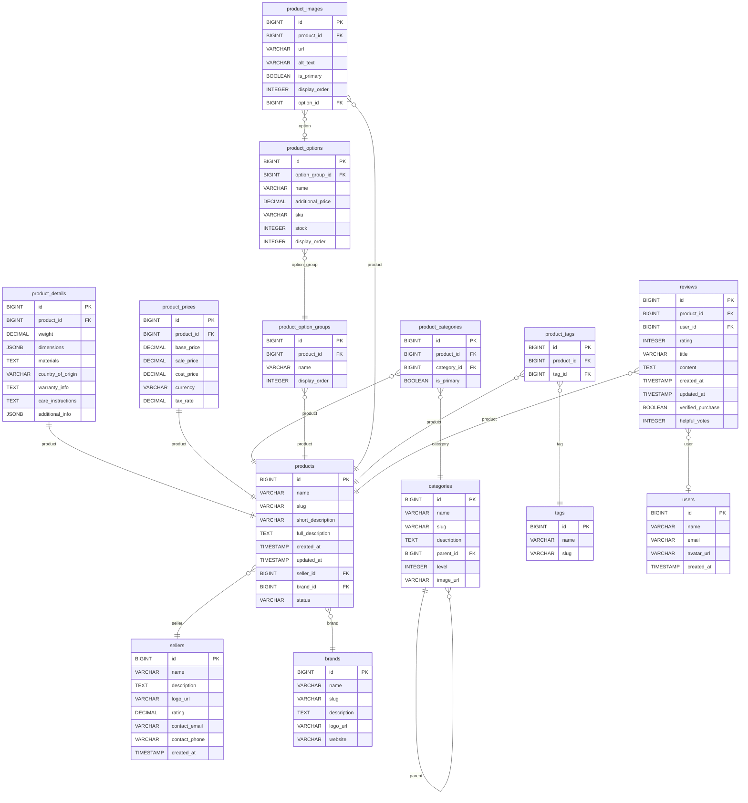

# CQRS 시스템 설계/구축 챌린지

> 원티드 프리온보딩 챌린지 백엔드 31차

[](https://github.com/narcisource/wanted-preonboarding-challenge-backend-31/releases) [](https://github.com/narcisource/wanted-preonboarding-challenge-backend-31/actions/workflows/deploy-openapi.yml) [](https://github.com/narcisource/wanted-preonboarding-challenge-backend-31/actions/workflows/deploy-test-report.yml)

## 기술 스택

[](https://nestjs.com/) [](https://nodejs.org/ko) [](https://www.typescriptlang.org/)  
[](https://www.postgresql.org/) [](https://typeorm.io/)  
[](https://about.codecov.io/) [](https://jestjs.io/) [](https://swagger.io/)  
[](https://github.com/features/actions) [](https://eslint.org/) [](https://prettier.io/)  
[![Docker Compose](https://img.shields.io/badge/Docker_Compose-2AB4FF.svg?logo=&style=flat&logoColor=black)](https://docs.docker.com/compose/) [](https://www.docker.com/)

## API 명세서

본 프로젝트의 API 명세서는 GitHub Pages을 통해 Swagger UI로 제공됩니다.

| [](https://narcisource.github.io/wanted-preonboarding-challenge-backend-31/) |
| --- |
| &nbsp;&nbsp;&nbsp;[API 명세서 바로가기](https://narcisource.github.io/wanted-preonboarding-challenge-backend-31/)&nbsp;&nbsp;&nbsp; |

- GitHub Pages에 게시된 Swagger 문서는 **정적 문서용**으로 제공되며,  
  백엔드 서버 및 데이터베이스가 연결되어 있지 않기 때문에 실제 요청은 처리되지 않습니다.

- API 요청을 정상적으로 테스트하려면,  
  로컬 환경에서 Docker Compose를 사용해 서버와 데이터베이스를 실행한 후 Swagger UI에 접속합니다.

## 테스트 리포트

테스트 통과 여부와 커버리지 현황은 시각적으로 제공됩니다.

| [](https://narcisource.github.io/wanted-preonboarding-challenge-backend-31/test-report) | [](https://codecov.io/gh/narcisource/wanted-preonboarding-challenge-backend-31) |
| --- | --- |
| [테스트 리포트 바로가기](https://narcisource.github.io/wanted-preonboarding-challenge-backend-31/test-report) | [커버리지 대시보드 바로가기](https://codecov.io/gh/narcisource/wanted-preonboarding-challenge-backend-31) |

커버리지는 Codecov를 통해 분석됩니다.  
[](https://codecov.io/gh/NarciSource/test)


## ERD


```mermaid
erDiagram
    products {
        BIGINT id PK
        VARCHAR name
        VARCHAR slug
        VARCHAR short_description
        TEXT full_description
        TIMESTAMP created_at
        TIMESTAMP updated_at
        BIGINT seller_id FK
        BIGINT brand_id FK
        VARCHAR status
    }

    categories {
        BIGINT id PK
        VARCHAR name
        VARCHAR slug
        TEXT description
        BIGINT parent_id FK
        INTEGER level
        VARCHAR image_url
    }

    sellers {
        BIGINT id PK
        VARCHAR name
        TEXT description
        VARCHAR logo_url
        DECIMAL rating
        VARCHAR contact_email
        VARCHAR contact_phone
        TIMESTAMP created_at
    }

    brands {
        BIGINT id PK
        VARCHAR name
        VARCHAR slug
        TEXT description
        VARCHAR logo_url
        VARCHAR website
    }

    product_details {
        BIGINT id PK
        BIGINT product_id FK
        DECIMAL weight
        JSONB dimensions
        TEXT materials
        VARCHAR country_of_origin
        TEXT warranty_info
        TEXT care_instructions
        JSONB additional_info
    }

    product_prices {
        BIGINT id PK
        BIGINT product_id FK
        DECIMAL base_price
        DECIMAL sale_price
        DECIMAL cost_price
        VARCHAR currency
        DECIMAL tax_rate
    }

    product_categories {
        BIGINT id PK
        BIGINT product_id FK
        BIGINT category_id FK
        BOOLEAN is_primary
    }

    product_option_groups {
        BIGINT id PK
        BIGINT product_id FK
        VARCHAR name
        INTEGER display_order
    }

    product_options {
        BIGINT id PK
        BIGINT option_group_id FK
        VARCHAR name
        DECIMAL additional_price
        VARCHAR sku
        INTEGER stock
        INTEGER display_order
    }

    product_images {
        BIGINT id PK
        BIGINT product_id FK
        VARCHAR url
        VARCHAR alt_text
        BOOLEAN is_primary
        INTEGER display_order
        BIGINT option_id FK
    }

    product_tags {
        BIGINT id PK
        BIGINT product_id FK
        BIGINT tag_id FK
    }

    tags {
        BIGINT id PK
        VARCHAR name
        VARCHAR slug
    }

    reviews {
        BIGINT id PK
        BIGINT product_id FK
        BIGINT user_id FK
        INTEGER rating
        VARCHAR title
        TEXT content
        TIMESTAMP created_at
        TIMESTAMP updated_at
        BOOLEAN verified_purchase
        INTEGER helpful_votes
    }

    users {
        BIGINT id PK
        VARCHAR name
        VARCHAR email
        VARCHAR avatar_url
        TIMESTAMP created_at
    }

    products }o--|| sellers : seller
    products }o--|| brands : brand
    product_details ||--|| products : product
    product_prices ||--|| products : product
    product_categories }o--|| products : product
    product_categories }o--|| categories : category
    categories ||--o{ categories : parent
    product_option_groups }o--|| products : product
    product_options }o--|| product_option_groups : option_group
    product_images }o--o| product_options : option
    product_images }o--|| products : product
    product_tags }o--|| products : product
    product_tags }o--|| tags : tag
    reviews }o--|| products : product
    reviews }o--o| users : user
```

## 폴더 구조

<details>
<summary>열기</summary>

```
wanted-preonboarding-challenge-backend-31
├─ data
│  ├─ 01.ddl.sql
│  ├─ 02.sellers.sql
│  ├─ 03.brands.sql
│  ├─ 04.categories.sql
│  ├─ 05.tags.sql
│  ├─ 06.products.sql
│  ├─ 07.product_options.sql
│  ├─ 08.product_extended.sql
│  ├─ 09.users.sql
│  └─ 10.reviews.sql
├─ src
│  ├─ domain
│  │  ├─ entities
│  │  │  └─ index.ts
│  │  │     ├─ Product.ts
│  │  │     ├─ Product_Detail.ts
│  │  │     ├─ Product_Image.ts
│  │  │     ├─ Product_Option.ts
│  │  │     ├─ Product_Price.ts
│  │  │     ├─ Brand.ts
│  │  │     ├─ Category.ts
│  │  │     ├─ Review.ts
│  │  │     ├─ Seller.ts
│  │  │     ├─ Tag.ts
│  │  │     └─ User.ts
│  │  └─ repositories
│  │     └─ index.ts
│  │        ├─ IMainRepository.ts
│  │        └─ IRepository.ts
│  ├─ application
│  │  ├─ dto
│  │  │  └─ index.ts
│  │  │     ├─ Filter.dto.ts
│  │  │     ├─ ProductCatalog.dto.ts
│  │  │     ├─ ProductCategory.dto.ts
│  │  │     ├─ ProductInput.dto.ts
│  │  │     ├─ ProductOptionGroup.dto.ts
│  │  │     ├─ ProductSummary.dto.ts
│  │  │     └─ ProductTag.dto.ts
│  │  └─ services
│  │     └─ index.ts
│  │        ├─ Product.service.ts
│  │        │  └─ Product.service.test.ts
│  │        ├─ Product_Options.service.ts
│  │        │  └─ Product_Options.service.test.ts
│  │        ├─ Main.service.ts
│  │        │  └─ Main.service.test.ts
│  │        ├─ Category.service.ts
│  │        │  └─ Category.service.test.ts
│  │        └─ Review.service.ts
│  │           └─ Review.service.test.ts
│  ├─ infrastructure
│  │  ├─ auth
│  │  │  ├─ jwtInterceptor.ts
│  │  │  └─ verifier.ts
│  │  ├─ entities
│  │  │  └─ index.ts
│  │  │     ├─ Product.entity.ts
│  │  │     │  └─ Product.entity.test.ts
│  │  │     ├─ Product_Category.entity.ts
│  │  │     │  └─ Product_Category.entity.test.ts
│  │  │     ├─ Product_Detail.entity.ts
│  │  │     │  └─ Product_Detail.entity.test.ts
│  │  │     ├─ Product_Image.entity.ts
│  │  │     │  └─ Product_Image.entity.test.ts
│  │  │     ├─ Product_Option.entity.ts
│  │  │     │  └─ Product_Option.entity.test.ts
│  │  │     ├─ Product_Option_Group.entity.ts
│  │  │     │  └─ Product_Option_Group.entity.test.ts
│  │  │     ├─ Product_Price.entity.ts
│  │  │     │  └─ Product_Price.entity.test.ts
│  │  │     ├─ Product_Tag.entity.ts
│  │  │     │  └─ Product_Tag.entity.test.ts
│  │  │     ├─ Brand.entity.ts
│  │  │     │  └─ Brand.entity.test.ts
│  │  │     ├─ Category.entity.ts
│  │  │     │  └─ Category.entity.test.ts
│  │  │     ├─ Review.entity.ts
│  │  │     │  └─ Review.entity.test.ts
│  │  │     ├─ Seller.entity.ts
│  │  │     │  └─ Seller.entity.test.ts
│  │  │     ├─ Tag.entity.ts
│  │  │     │  └─ Tag.entity.test.ts
│  │  │     └─ User.entity.ts
│  │  │        └─ User.entity.test.ts
│  │  ├─ repositories
│  │  │  └─ index.ts
│  │  │     ├─ BaseRepository.ts
│  │  │     ├─ Product.repository.ts
│  │  │     │  └─ Product.repository.test.ts
│  │  │     ├─ Product_Category.repository.ts
│  │  │     │  └─ Product_Category.repository.test.ts
│  │  │     ├─ Product_Detail.repository.ts
│  │  │     │  └─ Product_Detail.repository.test.ts
│  │  │     ├─ Product_Image.repository.ts
│  │  │     │  └─ Product_Image.repository.test.ts
│  │  │     ├─ Product_Options.repository.ts
│  │  │     │  └─ Product_Options.repository.test.ts
│  │  │     ├─ Product_Option_Group.repository.ts
│  │  │     │  └─ Product_Option_Group.repository.test.ts
│  │  │     ├─ Product_Price.repository.ts
│  │  │     │  └─ Product_Price.repository.test.ts
│  │  │     ├─ Product_Tag.repository.ts
│  │  │     │  └─ Product_Tag.repository.test.ts
│  │  │     ├─ Main.repository.ts
│  │  │     │  └─ Main.repository.test.ts
│  │  │     ├─ Category.repository.ts
│  │  │     │  └─ Category.repository.test.ts
│  │  │     └─ Review.repository.ts
│  │  │        └─ Review.repository.test.ts
│  │  ├─ views
│  │  │  └─ index.ts
│  │  │     ├─ ProductCatalog.view.ts
│  │  │     │  └─ ProductCatalog.view.test.ts
│  │  │     └─ ProductSummary.view.ts
│  │  │        └─ ProductSummary.view.test.ts
│  │  └─ provider.ts
│  ├─ presentation
│  │  ├─ controllers
│  │  │  └─ index.ts
│  │  │     ├─ Product.controller.ts
│  │  │     │  └─ Product.controller.test.ts
│  │  │     ├─ Product_Options.controller.ts
│  │  │     │  └─ Product_Options.controller.test.ts
│  │  │     ├─ Main.controller.ts
│  │  │     │  └─ Main.controller.test.ts
│  │  │     ├─ Category.controller.ts
│  │  │     │  └─ Category.controller.test.ts
│  │  │     └─ Review.controller.ts
│  │  │        └─ Review.controller.test.ts
│  │  ├─ decorators
│  │  │  └─ index.ts
│  │  │     ├─ ApiErrorResponse.ts
│  │  │     └─ ApiStandardResponse.ts
│  │  ├─ dto
│  │  │  └─ index.ts
│  │  │     ├─ model
│  │  │     │  ├─ Brand.dto.ts
│  │  │     │  │  └─ Brand.dto.test.ts
│  │  │     │  ├─ Category.dto.ts
│  │  │     │  │  └─ Category.dto.test.ts
│  │  │     │  ├─ Image.dto.ts
│  │  │     │  │  └─ Image.dto.test.ts
│  │  │     │  ├─ ProductDetail.dto.ts
│  │  │     │  │  └─ ProductDetail.dto.test.ts
│  │  │     │  ├─ ProductOption.dto.ts
│  │  │     │  │  └─ ProductOption.dto.test.ts
│  │  │     │  ├─ ProductOptionGroup.dto.ts
│  │  │     │  │  └─ ProductOptionGroup.dto.test.ts
│  │  │     │  ├─ ProductPrice.dto.ts
│  │  │     │  │  └─ ProductPrice.dto.test.ts
│  │  │     │  ├─ Review.dto.ts
│  │  │     │  │  └─ Review.dto.test.ts
│  │  │     │  ├─ Seller.dto.ts
│  │  │     │  │  └─ Seller.dto.test.ts
│  │  │     │  └─ Tag.dto.ts
│  │  │     │     └─ Tag.dto.test.ts
│  │  │     ├─ request
│  │  │     │  ├─ CategoryQuery.dto.ts
│  │  │     │  │  └─ CategoryQuery.dto.test.ts
│  │  │     │  ├─ Param.dto.ts
│  │  │     │  │  └─ Param.dto.test.ts
│  │  │     │  ├─ ProductBody.dto.ts
│  │  │     │  │  └─ ProductBody.dto.test.ts
│  │  │     │  ├─ ProductQuery.dto.ts
│  │  │     │  │  └─ ProductQuery.dto.test.ts
│  │  │     │  ├─ ReviewBody.dto.ts
│  │  │     │  │  └─ ReviewBody.dto.test.ts
│  │  │     │  └─ ReviewQuery.dto.ts
│  │  │     │     └─ ReviewQuery.dto.test.ts
│  │  │     ├─ response
│  │  │     │  ├─ CategoryResponseBundle.dto.ts
│  │  │     │  │  └─ CategoryResponseBundle.dto.test.ts
│  │  │     │  ├─ MainResponseBundle.dto.ts
│  │  │     │  │  └─ MainResponseBundle.dto.test.ts
│  │  │     │  ├─ NestedCategory.dto.ts
│  │  │     │  │  └─ NestedCategory.dto.test.ts
│  │  │     │  ├─ PaginationSummary.dto.ts
│  │  │     │  │  └─ PaginationSummary.dto.test.ts
│  │  │     │  ├─ ProductCatalog.dto.ts
│  │  │     │  │  └─ ProductCatalog.dto.test.ts
│  │  │     │  ├─ ProductResponse.dto.ts
│  │  │     │  │  └─ ProductResponse.dto.test.ts
│  │  │     │  ├─ ProductResponseBundle.dto.ts
│  │  │     │  │  └─ ProductResponseBundle.dto.test.ts
│  │  │     │  ├─ ProductSummary.dto.ts
│  │  │     │  │  └─ ProductSummary.dto.test.ts
│  │  │     │  ├─ Rating.dto.ts
│  │  │     │  │  └─ Rating.dto.test.ts
│  │  │     │  ├─ ReviewResponse.dto.ts
│  │  │     │  │  └─ ReviewResponse.dto.test.ts
│  │  │     │  ├─ ReviewResponseBundle.dto.ts
│  │  │     │  │  └─ ReviewResponseBundle.dto.test.ts
│  │  │     │  └─ ReviewSummary.dto.ts
│  │  │     │     └─ ReviewSummary.dto.test.ts
│  │  │     ├─ Error.dto.ts
│  │  │     │  └─ Error.dto.test.ts
│  │  │     └─ Response.dto.ts
│  │  │        └─ Response.dto.test.ts
│  │  ├─ filters
│  │  │  └─ index.ts
│  │  │     ├─ BadRequestExceptionFilter.ts
│  │  │     ├─ ConflictExceptionFilter.ts
│  │  │     ├─ ForbiddenExceptionFilter.ts
│  │  │     ├─ InternalServerErrorExceptionFilter.ts
│  │  │     ├─ NotFoundExceptionFilter.ts
│  │  │     ├─ QueryFailedExceptionFilter.ts
│  │  │     └─ UnauthorizedExceptionFilter.ts
│  │  └─ mappers
│  │     └─ index.ts
│  │        └─ to_FilterDTO.ts
│  ├─ utility
│  │  ├─ downloadOpenAPI.ts
│  │  ├─ generatorSwagger.ts
│  │  └─ extractDTOExample.ts
│  ├─ __mocks__
│  │  ├─ entityManagerMock.ts
│  │  └─ repositoryMock.ts
│  ├─ __test-utils__
│  │  └─ test-module.ts
│  ├─ main.ts
│  └─ module.ts
├─ .env
├─ docker-compose.yml
│  └─ Dockerfile
├─ jest.config.ts
│  └─ jest.setup.ts
├─ package.json
│  ├─ package-lock.json
│  ├─ .prettierrc
│  ├─ eslint.config.mjs
│  └─ nest-cli.json
├─ README.md
└─ tsconfig.json
   └─ tsconfig.build.json
```

</details>

## 실행 방법

### 도커환경

Docker Compose를 활용하여 서버와 데이터베이스를 각각 별도의 컨테이너로 구성하고, 공통 네트워크 환경에서 실행되도록 설정합니다.  
이를 통해 개발 및 테스트 환경에서의 서비스 간 통신을 간편하게 구성합니다.

```sh
# build
$ docker-compose build

# run
$ docker-compose up -d
```

### 서버 접근

서버는 환경변수 파일(.env)에 정의된 `PORT` 번호를 통해 외부 호스트에서 접근할 수 있습니다.  
기본 포트는 `3000`으로 설정되어 있으며, 로컬 환경에서 서버에 접속하려면 다음 주소를 이용합니다.

- 애플리케이션 접속: http://localhost:3000
- Swagger 문서 페이지: http://localhost:3000/swagger-ui/index.html
